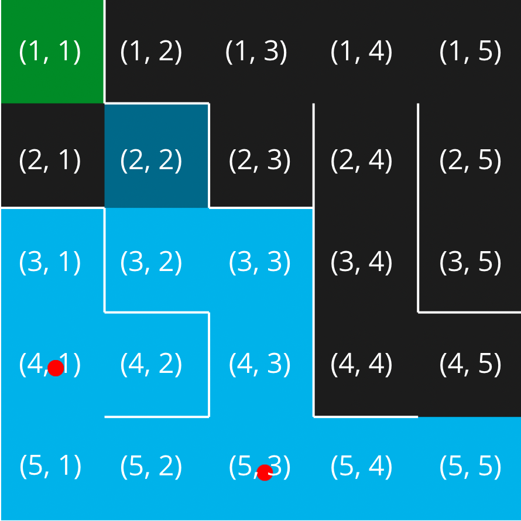
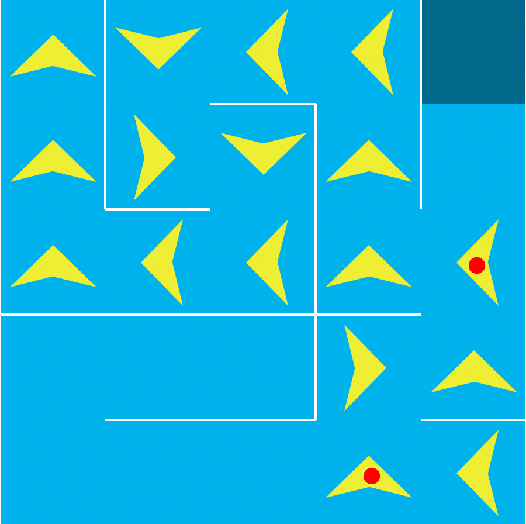

# Maze Algorithm

The mapping algorithm logs every cell in the maze, it follows the left-hand wall to reach every cell. With that data the pathfinder algorithm creates the best path for the pathfinder agent to take. This is determined by the penalties given out by the mapping agent.

----

## Mapping

The mapping algorithm follows the left-hand side wall until it has mapped all cells in the maze. Penalties are handed out to dead end cells to help the pathfinder algorithm determine a path. Red dots are placed on intersections because they require a decision to be made.



----

## Traversal

Once the mapping algorithm is completed, the traversal one starts. It determines the optimal path based on which direction has less penalties at intersections.



----

## Aggregate Data Structures

Aggregate data structures are used to store all related data together. Examples of this include strings, arrays, classes, and structures. In this algorithm arrays were used to store the mapped cells in the maze. Strings were used to store a path for the agent.

*<a href="https://www.cs.uregina.ca/Links/class-info/cplusplus/Standards/Disk1/cs_230__aggregate_data.htm" target="_blank">University of Regina, Aggregate Data Types</a>*

----

## Usage

The algorithm only requires two arguments; row count and colum count. These are used to determine the size of the maze.

**Example in Python**
```Python
maze_algorithm(5, 5)
```

----
